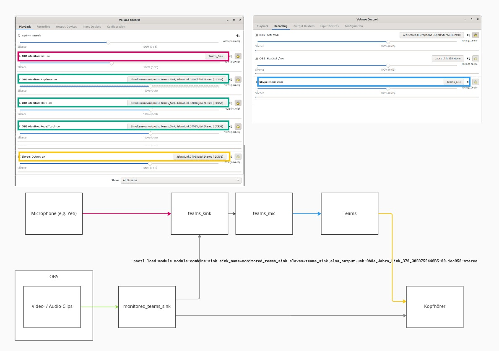
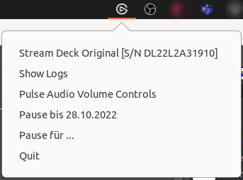

What this is
============

This is my personal tooling for videoconferencing on Ubuntu.
It features Stream Deck to control OBS and some little shell functionality.
It is built in Python and a reasonable amount of Bash.

It provides additional sinks, sources and connections in Pulse Audio to support monitored audio output to Teams.

It provides an AppIndicator for administration and user feedback:

Thanks to [Lorna Jane](https://github.com/lornajane/streamdeck-tricks) [Mitchell](https://opensource.com/article/20/12/stream-deck) for inspiration.
For me, Python was more approachable than Go.

Setup
=====

 - Configure USB rules: https://python-elgato-streamdeck.readthedocs.io/
 - Configure Pulse Audio:
    `ln -s $(pwd)/default.pa ~/.config/pulse/default.pa`
 - Reboot

Libraries
=========
 - The [PyGObject](https://pygobject.readthedocs.io) Gtk wrapper
   - https://lazka.github.io/pgi-docs/
   - https://python-gtk-3-tutorial.readthedocs.io/
 - The [streamdeck](https://github.com/abcminiuser/python-elgato-streamdeck) library
   - https://python-elgato-streamdeck.readthedocs.io/
 - The [simpleobsws](https://github.com/IRLToolkit/simpleobsws) library to connect to OBS via its WebSocket interface.

Pulse Audio
===========

    pactl list sink-inputs | less

 - https://github.com/mk-fg/python-pulse-control
   - https://freedesktop.org/software/pulseaudio/doxygen/introspect_8h.html
 - https://pypi.org/project/pulsectl-asyncio/
 
 
Window Management
=================

https://stackoverflow.com/questions/288512/resizing-a-window-to-a-set-size-in-linux

http://www.sweb.cz/tripie/utils/wmctrl/

    wmctrl -l
    wmctrl -r Firefox -b toggle,maximized_horz
    wmctrl -r "push-service – KundenDfueSuchMapping.java [hellas-gateway]" -e 0,0,0,1280,720

Resources
=========
 - https://docs.python.org/3/howto/logging.html
 - Sound configuration
   - Pulse Audio Volume Control
     - https://wiki.ubuntuusers.de/pavucontrol/
   - Pulse Audio Volume Meter
   - https://wiki.ubuntuusers.de/Soundsystem/
   - https://wiki.ubuntuusers.de/PulseAudio/
      - https://wiki.ubuntuusers.de/PulseAudio/#Prioritaet-erhoehen
